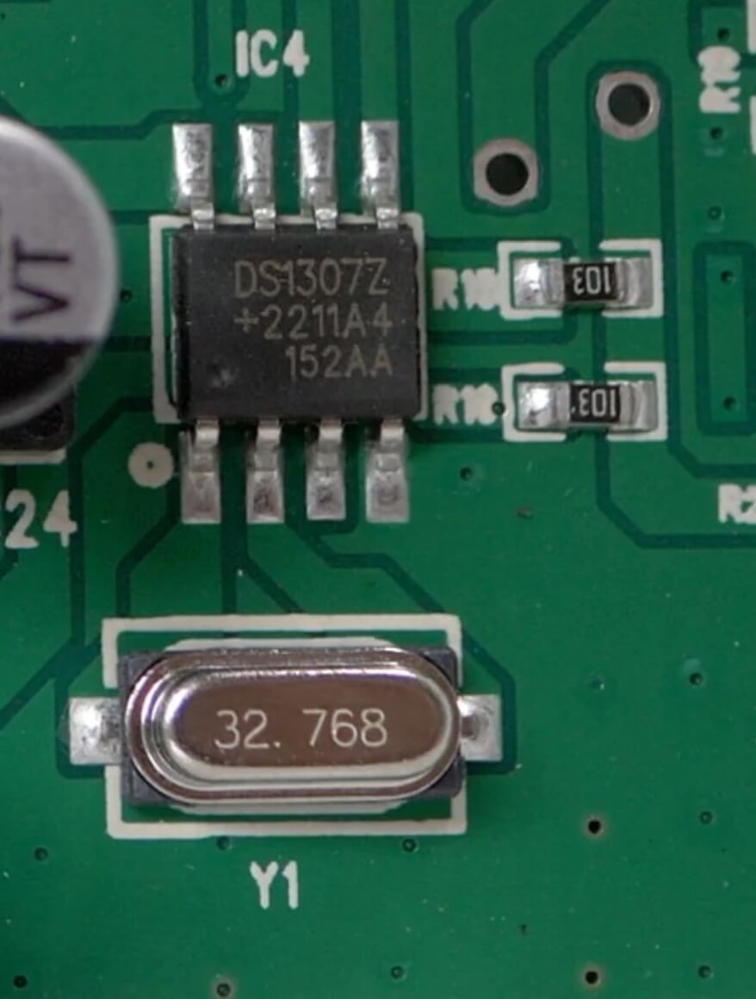
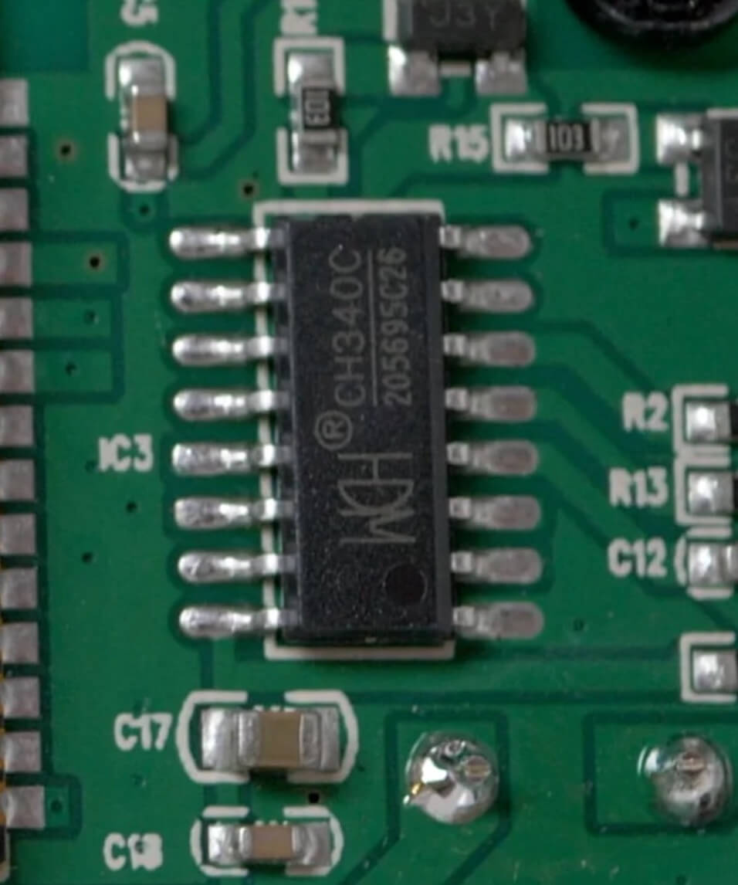
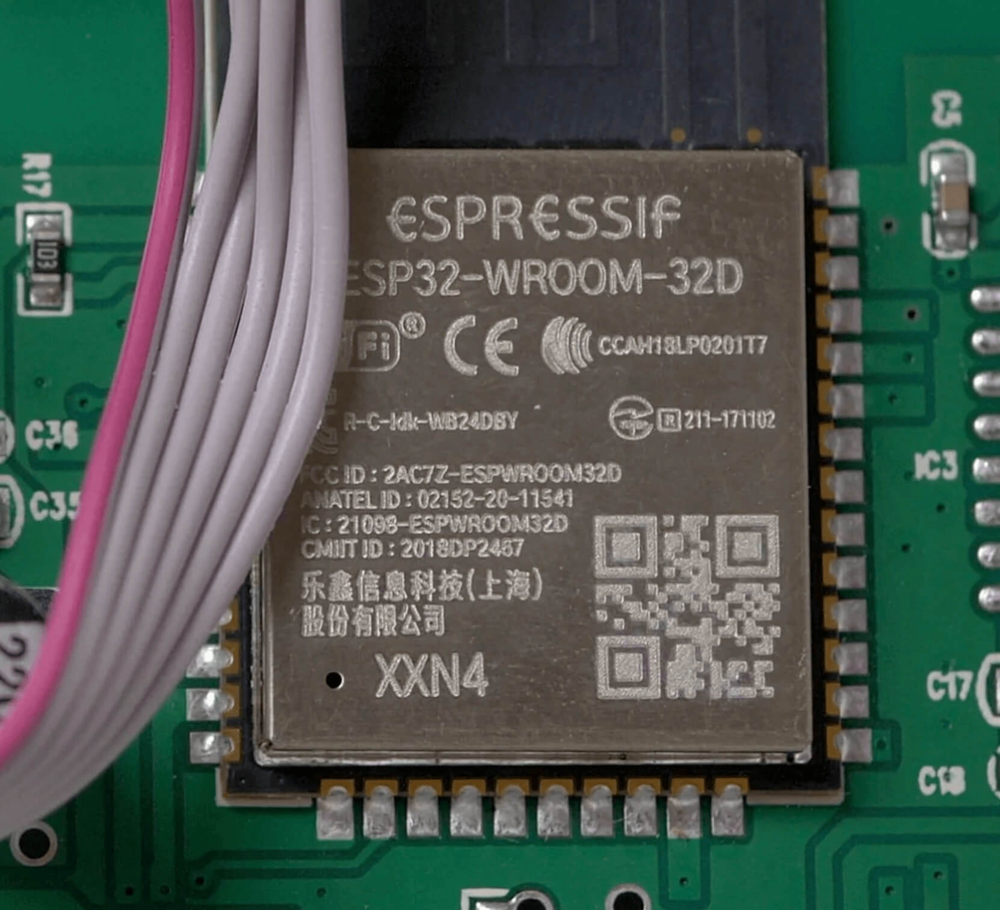
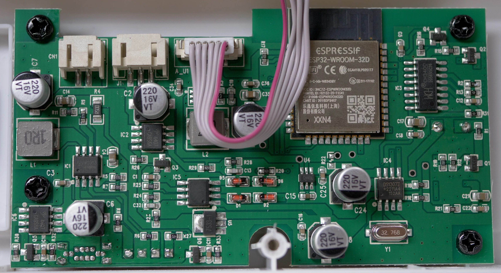
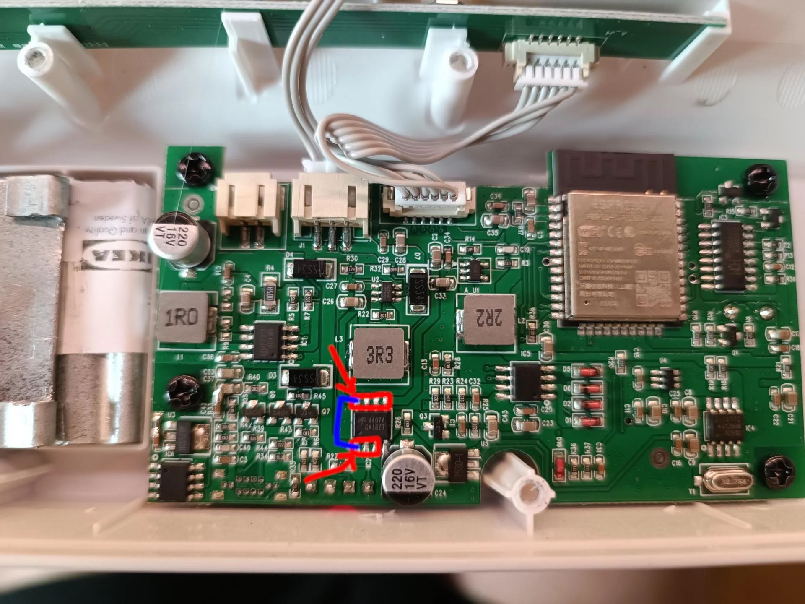

# Ulanzi TC001 Hardware Description and Arduino Examples


## Table of Contents

* Introduction
* Hardware Description
	* Pinout Summary
	* Buttons
	* Temperature and Humidity Sensor
	* Light Sensor
	* Buzzer
	* LED Matrix
	* Real Time Clock (RTC)
	* Battery (and Voltage Measurement)
	* USB to Serial Port Chip
	* Microcontroller
	* PCB
* Development Environment
	* Arduino IDE
	* Arduino CLI
	* PlatormIO 	
* Arduino Examples
	* Backup Firmware
	* Buttons 
	* Light Sensor 
	* Battery Voltage
    * Buzzer
    * RTC
    * Temperature / Humidity Sensor
    * LED Matrix
* Troubleshooting
* References


## Introduction

The Ulanzi TC001 "Smart Pixel Clock" is a nice gadget, and out-of-the-box it can used a smart clock, weather display, follower counter, and more. However, it is also known for its "hackability", meaning that it is relatively easy to modify the hardware and software, and use the device for other purposes. The built-in CH340 USB-to-Serial chip gives us full access to the ESP32 microcontroller via USB, allowing us to easily flash it with custom firmware for alternative use cases. One popular use of the device, is to use it as an information display in a Home Assistant environment.

When I tried to write custom firmware for this device, I found that the hardware documentation was lacking. Small details are scattered across repositories and forum threads, but I could not find a complete overview. This repository describes the hardware in detail, allowing you to make full use of all the hardware components on your custom firmware. Some code examples are also provided for Arduino-ESP32. 

The device can be purchased from the official website, but can also be found on Amazon and other retailers:

[https://www.ulanzi.com/products/ulanzi-pixel-smart-clock-2882](https://www.ulanzi.com/products/ulanzi-pixel-smart-clock-2882)


## Hardware Description

The following information was verified on an Ulanzi TC001, purchased from Amazon early 2025. Although we know that there are different PCB revisions, the following information is the same for all these revisions, at the time of writing. 

### Pinout Summary

| Hardware Component | GPIO | Info |
|---|---|---|
| Battery Voltage Measurement| GPIO34 / ADC6 | | 
| Light Sensor 	 | GPIO35 / ADC7 | GL5516 | 
| Buzzer 	 		 | GPIO15        | | 
| LED Matrix 	 	 | GPIO32 | WS2812 (256 LEDs, 8x32)| 
| Temperature / Humidity Sensor | I2C (SDA=`GPIO21`, SCL=`GPIO22`) | SHT3x, address `0x44` | 
| RTC | I2C (SDA=`GPIO21`, SCL=`GPIO22`) | DS1307, address `0x68`| 
| Left Button | GPIO26 | Active low|
| Middle Button | GPIO27 | Active low | 
| Right Button | GPIO14 | Active low |

### Buttons

The three buttons at the top of the device are connected to the following pins:

| Button&nbsp;&nbsp;| GPIO Pin |
| --- | --- |
| Left   | GPIO26 |
| Middle | GPIO27 |
| Right  | GPIO14 |


The buttons are active low, meaning the signal is LOW when pressed, HIGH when unpressed. 

It's a good idea to activate the internal pullup resistor, to avoid having the button pins in a floating state:

```C
 pinMode(26, INPUT_PULLUP);
 pinMode(27, INPUT_PULLUP);
 pinMode(14, INPUT_PULLUP);
```

### Temperature and Humidity Sensor

Temperature and humidity are both measured by a single SHT3x (SHT31?) sensor:

[https://sensirion.com/media/documents/213E6A3B/63A5A569/Datasheet\_SHT3x\_DIS.pdf](https://sensirion.com/media/documents/213E6A3B/63A5A569/Datasheet_SHT3x_DIS.pdf)

Communication with the sensor is done via I2C (SDA=`GPIO21`, SCL=`GPIO22`), at address `0x44`. 

Note that the temperature will often be a bit higher than the actual air temperature, as the sensor is easily affected by the heat of the LED matrix, microcontroller and battery in the small plastic enclosure. 

### Light Sensor

The light sensor is at the top of the device, next to the buttons. It is a simple GL5516 photoresistor.

[https://www.kth.se/social/files/54ef17dbf27654753f437c56/GL5537.pdf](https://www.kth.se/social/files/54ef17dbf27654753f437c56/GL5537.pdf)

It is connected to analog pin `GPIO35` (ADC7), and the measured voltage represents the light intensity. 

The following library can be used to convert the raw GL5516 output into lux: [https://github.com/QuentinCG/Arduino-Light-Dependent-Resistor-Library](https://github.com/QuentinCG/Arduino-Light-Dependent-Resistor-Library)

### Buzzer

The buzzer is connected to `GPIO15`, and can be used to produce "beeps" at various pitches. To use the buzzer, send a square wave signal through `GPIO15`, and the wave's frequency will determine the "pitch" of the beep. Use something like Arduino's `tone()` function (or another buzzer library) to facilitate this. 

WARNING: Do not leave this pin floating, or "random noise" on the pin will cause a high pitched whine out of the buzzer. Active the internal pull-down resistor in the ESP32 to make sure the default state of the pin is "low":

```C
pinMode(15, INPUT_PULLDOWN);
```

### LED Matrix

The LED Matrix is a 8x32 matrix of daisy-chained WS2812. 

[https://cdn-shop.adafruit.com/datasheets/WS2812.pdf](https://cdn-shop.adafruit.com/datasheets/WS2812.pdf)

`GPIO32` is connected to the first LED. As they are daisy-chained, the digital signal is passed down the whole chain, which is why you only need `GPIO32` to address any LED in the matrix. 

The LEDs are connected in a single chain, with the even rows going from left to right, and the uneven rows going from right to left. The following table represents this chain:

| Row | Sequence                                           |
|-----|----------------------------------------------------|
| 1   | [001] -> [002] -> [003] -> ... -> [030] -> [031] -> [032] |
| 2   | [064] <- [063] <- [062] <- ... <- [035] <- [034] <- [033] |
| 3   | [065] -> [066] -> [067] -> ... -> [094] -> [095] -> [096] |
| 4   | [128] <- [127] <- [126] <- ... <- [099] <- [098] <- [097] |
| 5   | [129] -> [130] -> [131] -> ... -> [158] -> [159] -> [160] |
| 6   | [192] <- [191] <- [190] <- ... <- [163] <- [162] <- [161] |
| 7   | [193] -> [194] -> [195] -> ... -> [222] -> [223] -> [224] |
| 8   | [256] <- [255] <- [254] <- ... <- [227] <- [226] <- [225] |


The protocol for the WS2812 is not trivial, so you probably want to use a library for this. 

### Real Time Clock

The built-in RTC in the ESP32 is not really suitable for accurate time-keeping. For this reason the Ulanzi TC001 also had a dedicated RTC, the DS1307.

[https://www.analog.com/media/en/technical-documentation/data-sheets/ds1307.pdf](https://www.analog.com/media/en/technical-documentation/data-sheets/ds1307.pdf)

Communication with the RTC is done via I2C (SDA=`GPIO21`, SCL=`GPIO22`), at address `0x68`. 



### Battery (and Voltage Measurement)

The Ulanzi TC001 has a built-in 4400mAh battery and battery charging circuit. 

Analog pin `GPIO34/ADC6` can be used to measure the (scaled) voltage. I assume this is implemented with a simple voltage divider, that scales down the battery voltage to a 0-3.3V range, which can be safely read by the ESP32.  

### USB to Serial Port Chip

The PCB has an CH340 USB-to-Serial chip, allowing direct communication to the ESP32 via USB. To me, the ¬ of this chip shows that Ulanzi wanted us to have easy access to the hardware, as there is no other reason to have such a chip in a consumer product. Thank you, Ulanzi!



### Microcontroller

The microcontroller is an ESP32-WROOM-32D.

[https://www.espressif.com/sites/default/files/documentation/esp32-wroom-32d_esp32-wroom-32u\_datasheet\_en.pdf](https://www.espressif.com/sites/default/files/documentation/esp32-wroom-32d_esp32-wroom-32u_datasheet_en.pdf)



You can treat it like any regular ESP32 (because it is), and use the usual tools to program it. 

### PCB

There seem to be different revisions of the PCB. However, there is no difference in the sensors and actuators described on this page. 

Here are some pictures of the PCB:





Credit for the images go to users popy2k17 and klein0r in this reddit thread:

[https://www.reddit.com/r/homeassistant/comments/131okf7/ulanzi_tc001/](https://www.reddit.com/r/homeassistant/comments/131okf7/ulanzi_tc001/)

## Development Environment 

In terms of development environment, the setup procedure is the same as any ESP32-based board. Thanks to the onboard CH340 chip you don't need any additional hardware to flash new firmware. For this reason I will mainly point to existing ESP32 tutorials.

### Arduino IDE

See for instance:

[https://samueladesola.medium.com/how-to-set-up-esp32-wroom-32-b2100060470c](https://samueladesola.medium.com/how-to-set-up-esp32-wroom-32-b2100060470c)

In summary:

* Add the additional board manager URL for the ESP32 in the preference window:
	* https://dl.espressif.com/dl/package_esp32_index.json
* Download "ESP32 by espressif" in the board manager
* Select "NODEMCU-32S" as the target board

### Arduino CLI

Install Arduino CLI:

```bash
https://arduino.github.io/arduino-cli/latest/installation
```

Install Arduino Core for ESP32 (official package by Espressif):

```bash
arduino-cli core update-index --additional-urls https://dl.espressif.com/dl/package_esp32_index.json
arduino-cli core search esp32:esp32 --additional-urls https://dl.espressif.com/dl/package_esp32_index.json
arduino-cli core install esp32:esp32  --additional-urls https://dl.espressif.com/dl/package_esp32_index.json
```

None of the following libraries are strictly necessary for the Ulanzi TC001, but if you want to run the examples in this document, you will also need to install these libraries:

```bash
arduino-cli lib install "Adafruit GFX Library"
arduino-cli lib install "Adafruit BusIO"
arduino-cli lib install "FastLED"
arduino-cli lib install "FastLED NeoMatrix"
arduino-cli lib install "Framebuffer GFX"
arduino-cli lib install "RTCLib"
arduino-cli lib install "SHT31"
```

To build your firmware:

```bash
arduino-cli compile --fqbn esp32:esp32:esp32 --verbose buttons.ino
```

Upload to ESP32:

```bash
arduino-cli board list
arduino-cli upload --fqbn esp32:esp32:esp32 --port /dev/cu.wchusbserial145230 --verbose
```

Monitor Serial output:

```bash
arduino-cli monitor --fqbn esp32:esp32:esp32 --port /dev/cu.wchusbserial145230 --discovery-timeout 2m
```

### PlatformIO

See [https://platformio.org/](https://platformio.org/) to set up PlatformIO.

PlatformIO config `src/platformio.ini` shows how to set it up for the Ulanzi TC001.

## Arduino Examples

### Backup Firmware

Before messing with the firmware, it's probably a good idea to make a backup of the factory firmware. This is done using the regular ESP32 tools (esptool.py). See:

[https://cyberblogspot.com/how-to-save-and-restore-esp8266-and-esp32-firmware/](https://cyberblogspot.com/how-to-save-and-restore-esp8266-and-esp32-firmware/)

In summary, check how big the flash is:

```bash
esptool.py flash_id
```

esptool confirms that we have 8MB of flash memory to backup:

```bash
esptool.py v4.8.1
Found 2 serial ports
Serial port /dev/cu.wchusbserial145230
Connecting....
Detecting chip type... Unsupported detection protocol, switching and trying again...
Connecting....
Detecting chip type... ESP32
Chip is ESP32-D0WD (revision v1.0)
Features: WiFi, BT, Dual Core, 240MHz, VRef calibration in efuse, Coding Scheme None
Crystal is 40MHz
MAC: e8:9f:6d:46:be:94
Uploading stub...
Running stub...
Stub running...
Manufacturer: 20
Device: 4017
Detected flash size: 8MB
Flash voltage set by a strapping pin to 3.3V
Hard resetting via RTS pin...
```

We use the port and flash size from the output above, and use those values to perform the backup like this:

```
esptool.py --baud 230400 --port /dev/cu.wchusbserial145230 read_flash 0x0 0x800000 ulanzi-backup-8M.bin
```

### Buttons

Note: this is a minimal example to illustrate how the hardware works. Ideally a dedicated library is used to handle button input (including debouncing, interrupts, etc.)

After flashing this example, watch the serial monitor to see some output when pressing the buttons.
	
```C++
#define PIN_BUZZER			15
#define PIN_BUTTON_LEFT		26
#define PIN_BUTTON_MIDDLE	27
#define PIN_BUTTON_RIGHT 	14

void setup() {
    Serial.begin(115200);

    pinMode(PIN_BUZZER, INPUT_PULLDOWN); // prevent random signal noise from triggering the buzzer

    pinMode(PIN_BUTTON_LEFT, INPUT_PULLUP);
    pinMode(PIN_BUTTON_MIDDLE, INPUT_PULLUP);
    pinMode(PIN_BUTTON_RIGHT, INPUT_PULLUP);
}

void loop() {
    if(digitalRead(PIN_BUTTON_LEFT) == LOW) {
    	Serial.println("left button");
    }

    if(digitalRead(PIN_BUTTON_MIDDLE) == LOW) {
    	Serial.println("middle button");
    }

    if(digitalRead(PIN_BUTTON_RIGHT) == LOW) {
    	Serial.println("right button");
    }

    delay(500);
}
```

### Light Sensor 

#### Example 1: Raw Value

```C++
#define PIN_BUZZER          15
#define PIN_LIGHT_SENSOR    35

void setup() {
    Serial.begin(115200);

    pinMode(PIN_BUZZER, INPUT_PULLDOWN); // prevent random signal noise from triggering the buzzer
    pinMode(PIN_LIGHT_SENSOR, INPUT);
}

void loop() {
    int light = analogRead(PIN_LIGHT_SENSOR);

    Serial.print("light: ");
    Serial.println(light);

    delay(1000);
}
```

#### Example 2: Lux Value

The next example uses this library to obtain a value in lux: [https://github.com/QuentinCG/Arduino-Light-Dependent-Resistor-Library](https://github.com/QuentinCG/Arduino-Light-Dependent-Resistor-Library).
Don't forget to install the library via your development environment (Arduino IDE, Arduino CLI, PlatformIO, ...).

```C++
#include <LightDependentResistor.h>

#define PIN_BUZZER          15
#define PIN_LIGHT_SENSOR    35

LightDependentResistor photocell(PIN_LIGHT_SENSOR,
                                 10000, // 10k pulldown-resistor
                                 LightDependentResistor::GL5516,
                                 12,    // ESP32 default ADC resolution
                                 0);    // smoothing of 0, set this higher if you want to average out the value over time

void setup() {
    Serial.begin(115200);

    pinMode(PIN_BUZZER, INPUT_PULLDOWN); // prevent random signal noise from triggering the buzzer
    pinMode(PIN_LIGHT_SENSOR, INPUT);

    photocell.setPhotocellPositionOnGround(false);
}

void loop() {
    float lux = photocell.getCurrentLux();

    Serial.print("lux: ");
    Serial.println(lux);

    delay(1000);
}
```

### Battery Voltage

#### Example 1: Raw Value

```C++
#define PIN_BUZZER          15
#define PIN_BATTERY_VOLTAGE 34

void setup() {
    Serial.begin(115200);

    pinMode(PIN_BUZZER, INPUT_PULLDOWN); // prevent random signal noise from triggering the buzzer
    pinMode(PIN_BATTERY_VOLTAGE, INPUT);
}

void loop() {
    int voltage = analogRead(PIN_BATTERY_VOLTAGE);

    Serial.print("voltage: ");
    Serial.println(voltage);

    delay(1000);
}
```

#### Example 2: Mapped Value

```C++
#define PIN_BUZZER          15
#define PIN_BATTERY_VOLTAGE 34

void setup() {
    Serial.begin(115200);

    pinMode(PIN_BUZZER, INPUT_PULLDOWN); // prevent random signal noise from triggering the buzzer
    pinMode(PIN_BATTERY_VOLTAGE, INPUT);
}

void loop() {
    float voltage = getBatteryVoltage();

    Serial.print("voltage: ");
    Serial.println(voltage);

    delay(1000);
}

// credits: https://github.com/aptonline/PixelIt_Ulanzi/blob/main/src/PixelIt.ino
float getBatteryVoltage()
{
    float batteryLevelPct = map(analogRead(PIN_BATTERY_VOLTAGE), 510, 660, 0, 100);
    if (batteryLevelPct >= 100) { batteryLevelPct = 100; }
    if (batteryLevelPct <= 0) { batteryLevelPct = 1; }
    return batteryLevelPct;
}
```

### Buzzer

This example makes use of Arduino's `tone()` function to generate sound: [https://docs.arduino.cc/language-reference/en/functions/advanced-io/tone/](https://docs.arduino.cc/language-reference/en/functions/advanced-io/tone/)

```C++
#define PIN_BUZZER 15

uint8_t freq_index = 0;
uint8_t freq_count = 4;
int freqs[4] = {247, 262, 294, 330};

void setup() {
    Serial.begin(115200);
    pinMode(PIN_BUZZER, OUTPUT);
}

void loop() {
    tone(PIN_BUZZER, freqs[freq_index], 500);
    delay(500);

    if(++freq_index == freq_count){freq_index = 0;}
}
```

### RTC

The RTC built into the ESP32 is not very accurate, and is not meant to be used to tracking real-world time. Instead, you should use the DS1307 on the PCB.

There are plenty of libraries for Arduino for the DS1307:
* https://github.com/PaulStoffregen/DS1307RTC
* https://github.com/adafruit/RTClib
* https://docs.arduino.cc/libraries/urtclib/
* ...

This examples uses [Adafruit's RTClib](https://github.com/adafruit/RTClib). Don't forget to install the library via your development environment (Arduino IDE, Arduino CLI, PlatformIO, ...).

```C++
#include "RTClib.h"

#define PIN_BUZZER 15

RTC_DS1307 rtc;
DateTime now;
time_t unix_time;

void setup () {
    Serial.begin(115200);

    pinMode(PIN_BUZZER, INPUT_PULLDOWN); // prevent random signal noise from triggering the buzzer

    // set the time to the time of compilation
    if (!rtc.isrunning()) {
        rtc.adjust(DateTime(F(__DATE__), F(__TIME__)));
    }
}

void loop () {
    now = rtc.now();
    unix_time = now.unixtime();

    Serial.print("time : ");
    Serial.print(unix_time);
    Serial.print(", ");
    Serial.print(ctime(&unix_time));

    delay(1000);
}
```

Ideally the time is set by querying a timeserver over WiFi, but that is outside of the scope of these examples. Plenty of examples for the ESP32 can be found elsewhere. E.g.:

[https://randomnerdtutorials.com/esp32-ds1307-real-time-clock-rtc-arduino/](https://randomnerdtutorials.com/esp32-ds1307-real-time-clock-rtc-arduino/)

### Temperature / Humidity Sensor

There are plenty of libraries for Arduino for the SHT3x: 
* https://github.com/Sensirion/arduino-i2c-sht3x
* https://github.com/RobTillaart/SHT31
* https://github.com/adafruit/Adafruit_SHT31
* ...

The following example uses [Rob Tillaart's SHT31 library](https://github.com/RobTillaart/SHT31).
Don't forget to install the library via your development environment (Arduino IDE, Arduino CLI, PlatformIO, ...).

As mentioned before, the temperature sensor is influenced by heat from the LED matrix, microcontroller and battery, so the reported temperature is usually a bit higher than the actual air temperature.

```C++
#include "SHT31.h"

#define PIN_BUZZER 15

SHT31 sht;

void setup()
{
    Serial.begin(115200);
    Wire.begin();

    pinMode(PIN_BUZZER, INPUT_PULLDOWN); // prevent random signal noise from triggering the buzzer
}


void loop()
{
    sht.read();

    Serial.print("temperature: ");
    Serial.print(sht.getTemperature(), 2);
    Serial.print(", humidity: ");
    Serial.println(sht.getHumidity(), 2);

    delay(1000);
}
```

### LED Matrix

FastLED is a great library to interface with the WS2812. The following is very minimal example of how to use FastLED.
Don't forget to install the library via your development environment (Arduino IDE, Arduino CLI, PlatformIO, ...).

```C++
#include <FastLED.h>

#define PIN_BUZZER      15
#define PIN_LED_MATRIX  32
#define NUM_LEDS        256

CRGB leds[NUM_LEDS];
uint8_t led_index = 0;

void setup() {
    Serial.begin(115200);
    pinMode(PIN_BUZZER, INPUT_PULLDOWN); // prevent random signal noise from triggering the buzzer

    FastLED.addLeds<WS2812B, PIN_LED_MATRIX, GRB>(leds, NUM_LEDS);
    FastLED.setBrightness(50);
}

void loop() {

    leds[led_index] = CRGB::Black;

    if(led_index == 255){
        led_index = 0;
    } else {
        led_index++;
    }

    leds[led_index] = CRGB::Red;
    FastLED.show();

    delay(50);
}
```

The above example works great, but you probably want more functionality than toggling individual LEDs. 
FastLED_NeoMatrix is a great library that provides an Adafruit GXF library for a matrix of 

[https://github.com/marcmerlin/FastLED_NeoMatrix](https://github.com/marcmerlin/FastLED_NeoMatrix)

With this library you can easily achieve text rendering, scrolling, drawing shapes, effects, etc. 
This is a minimal example for using FastLED_NeoMatrix on the Ulanzi TC001.
Don't forget to install the library via your development environment (Arduino IDE, Arduino CLI, PlatformIO, ...).

```C++
#include <Adafruit_GFX.h>
#include <FastLED.h>
#include <FastLED_NeoMatrix.h>

#define PIN_BUZZER          15
#define PIN_LED_MATRIX      32

CRGB matrixleds[256];
FastLED_NeoMatrix *matrix = new FastLED_NeoMatrix(matrixleds, 32, 8, NEO_MATRIX_TOP + NEO_MATRIX_LEFT + NEO_MATRIX_ROWS + NEO_MATRIX_ZIGZAG );

const uint16_t colors[] = { matrix->Color(255, 0, 0), matrix->Color(0, 255, 0), matrix->Color(0, 0, 255) };

void setup() {

    pinMode(PIN_BUZZER, INPUT_PULLDOWN); // prevent random signal noise from triggering the buzzer

    FastLED.addLeds<NEOPIXEL,PIN_LED_MATRIX>(matrixleds, 256);
    matrix->begin();
    matrix->setTextWrap(false);
    matrix->setBrightness(40);
    matrix->setTextColor(colors[0]);
}

int x    = 32;
int pass = 0;

void loop() {
    matrix->fillScreen(0);
    matrix->setCursor(x, 0);
    matrix->print(F("Howdy"));
    if(--x < -36) {
        x = matrix->width();
        if(++pass >= 3) pass = 0;
        matrix->setTextColor(colors[pass]);
    }
    matrix->show();
    delay(100);
}
```

## Troubleshooting

* The device makes an annoying noise (a continuous high-pitched beep)
  * You have to activate the internal pull-down for the buzzer pin (`pinMode(15, INPUT_PULLDOWN);`). See the buzzer section in the hardware description above.

## References

Relevant Documentation and Examples:

* https://www.ulanzi.com/products/ulanzi-pixel-smart-clock-2882
* https://dev.to/calumk/ulanzi-tc001-arduino-programming-nodemcu-590a
* https://sequr.be/blog/2023/03/ulanzi-tc001-desktop-clock-awtrix/
* https://templates.blakadder.com/ulanzi_TC001.html
* https://www.reddit.com/r/homeassistant/comments/131okf7/ulanzi_tc001/
* https://github.com/Blueforcer/awtrix3/blob/main/docs/hardware.md
* https://github.com/aptonline/PixelIt_Ulanzi/blob/main/platformio.ini

Datasheets:

* [https://sensirion.com/media/documents/213E6A3B/63A5A569/Datasheet\_SHT3x\_DIS.pdf](https://sensirion.com/media/documents/213E6A3B/63A5A569/Datasheet_SHT3x_DIS.pdf)
* [https://www.kth.se/social/files/54ef17dbf27654753f437c56/GL5537.pdf](https://www.kth.se/social/files/54ef17dbf27654753f437c56/GL5537.pdf)
* [https://www.analog.com/media/en/technical-documentation/data-sheets/ds1307.pdf](https://www.analog.com/media/en/technical-documentation/data-sheets/ds1307.pdf)
* [https://www.espressif.com/sites/default/files/documentation/esp32-wroom-32d_esp32-wroom-32u\_datasheet\_en.pdf](https://www.espressif.com/sites/default/files/documentation/esp32-wroom-32d_esp32-wroom-32u_datasheet_en.pdf)
* [https://cdn-shop.adafruit.com/datasheets/WS2812.pdf](https://cdn-shop.adafruit.com/datasheets/WS2812.pdf)