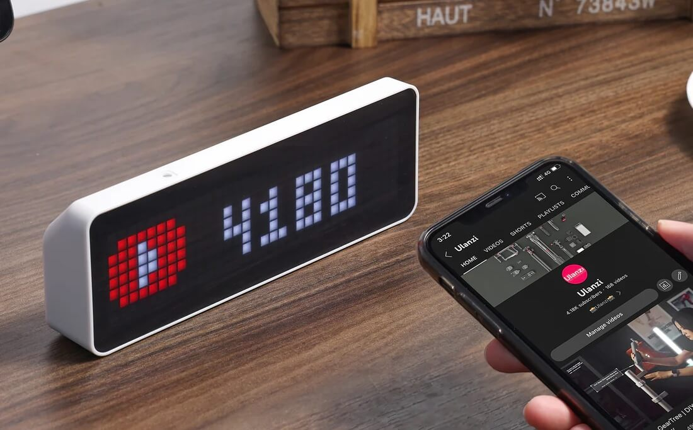

# Ulanzi TC001 Hardware Description and Arduino Examples

## Introduction

The Ulanzi TC001 "Smart Pixel Clock" is a nice gadget, and out-of-the-box it can used a smart clock, weather display, follower counter, and more. However, it is also known for its "hackability", meaning that it is relatively easy to modify the hardware and software, and use the device for other purposes. The built-in CH340 USB-to-Serial chip gives us full access to the ESP32 microcontroller via USB, allowing us to easily flash it with custom firmware for alternative use cases. One popular use of the device, is to use it as an information display in a Home Assistant environment.

When I tried to write custom firmware for this device, I found that the hardware documentation was lacking. Small details are scattered across repositories and forum threads, but I could not find a complete overview. This repository describes the hardware in detail, allowing you to make full use of all the hardware components on your custom firmware. Some code examples are also provided for Arduino-ESP32. 

The device can be purchased from the official website, but can also be found on Amazon and other retailers:

[https://www.ulanzi.com/products/ulanzi-pixel-smart-clock-2882](https://www.ulanzi.com/products/ulanzi-pixel-smart-clock-2882)



## Hardware Description

The following information was verified on an Ulanzi TC001, purchased from Amazon early 2025. Although we know that there are different PCB revisions, the following information is the same for all these revisions, at the time of writing. 

### Pinout Summary

| Hardware Component | GPIO | Info |
|---|---|---|
| Battery Voltage Measurement| GPIO34 / ADC6 | | 
| Light Sensor 	 | GPIO35 / ADC7 | GL5516 | 
| Buzzer 	 		 | GPIO15        | | 
| LED Matrix 	 	 | GPIO32 | WS2812 (256 LEDs, 8x32)| 
| Temperature / Humidity Sensor | I2C (SDA=`GPIO21`, SCL=`GPIO22`) | SHT3x, address `0x44` | 
| RTC | I2C (SDA=`GPIO21`, SCL=`GPIO22`) | DS1307, address `TODO`| 
| Left Button | GPIO26 | Active low|
| Middle Button | GPIO27 | Active low | 
| Right Button | GPIO14 | Active low |

### Buttons

The three buttons at the top of the device are connected to the following pins:

| Button&nbsp;&nbsp;| GPIO Pin |
| --- | --- |
| Left   | GPIO26 |
| Middle | GPIO27 |
| Right  | GPIO14 |


The buttons are active low, meaning the signal is LOW when pressed, HIGH when unpressed. 

It's a good idea to activate the internal pullup resistor, to avoid having the button pins in a floating state:

```C
 pinMode(26, INPUT_PULLUP);
 pinMode(27, INPUT_PULLUP);
 pinMode(14, INPUT_PULLUP);
```

### Temperature and Humidity Sensor

Temperature and humidity are both measured by a single SHT3x sensor:

[https://sensirion.com/media/documents/213E6A3B/63A5A569/Datasheet\_SHT3x\_DIS.pdf](https://sensirion.com/media/documents/213E6A3B/63A5A569/Datasheet_SHT3x_DIS.pdf)

Communication with the sensor is done via I2C (SDA=`GPIO21`, SCL=`GPIO22`), at address `0x44`. 

Note that the temperature is not very accurate, as the sensor is easily affected by the heat of the microcontroller and battery in the small plastic enclosure. 

### Light Sensor

The light sensor is at the top of the device, next to the buttons. It is a simple GL5516 photoresistor.

[https://www.kth.se/social/files/54ef17dbf27654753f437c56/GL5537.pdf](https://www.kth.se/social/files/54ef17dbf27654753f437c56/GL5537.pdf)

It is connected to analog pin `GPIO35` (ADC7), and the measured voltage represents the light intensity. 


### Buzzer

The buzzer is connected to `GPIO15`, and can be used to produce "beeps" at various pitches. To use the buzzer, send a square wave signal through `GPIO15`, and the wave's frequency will determine the "pitch" of the beep. Use something like Arduino's `tone()` function (or another buzzer library) to facilitate this. 

WARNING: Do not leave this pin floating, or "random noise" on the pin will cause a high pitched whine out of the buzzer. Active the internal pull-down resistor in the ESP32 to make sure the default state of the pin is "low":

```C
pinMode(15, INPUT_PULLDOWN);
```


### LED Matrix

The LED Matrix is a 8x32 matrix of daisy-chained WS2812. `GPIO32` is connected to the first LED. As they are daisy-chained, the digital signal is passed down the whole chain, which is why you only need `GPIO32` to address any LED in the matrix. 

The LEDs are connected in a single chain, with the even rows going from left to right, and the uneven rows going from right to left. The following table represents this chain:

| Row | Sequence                                           |
|-----|----------------------------------------------------|
| 1   | [001] -> [002] -> [003] -> ... -> [030] -> [031] -> [032] |
| 2   | [064] <- [063] <- [062] <- ... <- [035] <- [034] <- [033] |
| 3   | [065] -> [066] -> [067] -> ... -> [094] -> [095] -> [096] |
| 4   | [128] <- [127] <- [126] <- ... <- [099] <- [098] <- [097] |
| 5   | [129] -> [130] -> [131] -> ... -> [158] -> [159] -> [160] |
| 6   | [192] <- [191] <- [190] <- ... <- [163] <- [162] <- [161] |
| 7   | [193] -> [194] -> [195] -> ... -> [222] -> [223] -> [224] |
| 8   | [256] <- [255] <- [254] <- ... <- [227] <- [226] <- [225] |


The protocol for the WS2812 is not trivial, so you probably want to use a library for this. 

### Real Time Clock

The built-in RTC in the ESP32 is not really suitable for accurate time-keeping. For this reason the Ulanzi TC001 also had a dedicated RTC, the DS1307.

[https://www.analog.com/media/en/technical-documentation/data-sheets/ds1307.pdf](https://www.analog.com/media/en/technical-documentation/data-sheets/ds1307.pdf)

Communication with the RTC is done via I2C (SDA=`GPIO21`, SCL=`GPIO22`), at address `TODO`. 


### Battery (and Voltage Measurement)

The Ulanzi TC001 has a built-in 4400mAh battery and battery charging circuit. 

Analog pin `GPIO34/ADC6` can be used to measure the (scaled) voltage. I assume this is implemented with a simple voltage divider, that scales down the battery voltage to a 0-3.3V range, which can be safely read by the ESP32.  

### USB to Serial Port Chip

The PCB has an CH340 USB-to-Serial chip, allowing direct communication to the ESP32 via USB. To me, the ¬ of this chip shows that Ulanzi wanted us to have easy access to the hardware, as there is no other reason to have such a chip in a consumer product. Thank you, Ulanzi!


### Microcontroller

The microcontroller is an ESP32-WROOM-32D.

[https://www.espressif.com/sites/default/files/documentation/esp32-wroom-32d_esp32-wroom-32u\_datasheet\_en.pdf](https://www.espressif.com/sites/default/files/documentation/esp32-wroom-32d_esp32-wroom-32u_datasheet_en.pdf)


You can treat it like any regular ESP32 (because it is), and use the usual tools to program it. 

### PCB

There seem to be different revisions of the PCB. However, there is no difference in the sensors and actuators described on this page. 

Here are some pictures of the PCB:


Credit for the images go to users popy2k17 and klein0r in this reddit thread:

[https://www.reddit.com/r/homeassistant/comments/131okf7/ulanzi_tc001/](https://www.reddit.com/r/homeassistant/comments/131okf7/ulanzi_tc001/)

## Arduino Examples

### Backup Firmware

Before messing with the firmware, it's probably a good idea to make a backup of the factory firmware. This is done using the regular ESP32 tools (esptool.py). See:

[https://cyberblogspot.com/how-to-save-and-restore-esp8266-and-esp32-firmware/](https://cyberblogspot.com/how-to-save-and-restore-esp8266-and-esp32-firmware/)

### Development Environment 

In terms of development environment, the setup procedure is the same as any ESP32-based board. For this reason I will mainly point to existing tutorials.

#### Arduino IDE

See for instance:

[https://samueladesola.medium.com/how-to-set-up-esp32-wroom-32-b2100060470c](https://samueladesola.medium.com/how-to-set-up-esp32-wroom-32-b2100060470c)

In summary:

* Add the additional board manager URL for the ESP32 in the preference window:
	* https://dl.espressif.com/dl/package_esp32_index.json
* Download "ESP32 by espressif" in the board manager
* Select "NODEMCU-32S" as the target board

#### Arduino CLI

#### PlatformIO


### Buttons 


### Light Sensor 

### Battery Voltage

### RTC

### Buzzer

### LED Matrix

### Temperature / Humidity Sensor 


## References

* https://www.ulanzi.com/products/ulanzi-pixel-smart-clock-2882
* https://dev.to/calumk/ulanzi-tc001-arduino-programming-nodemcu-590a
* https://sequr.be/blog/2023/03/ulanzi-tc001-desktop-clock-awtrix/
* https://templates.blakadder.com/ulanzi_TC001.html
* https://www.reddit.com/r/homeassistant/comments/131okf7/ulanzi_tc001/
* https://github.com/Blueforcer/awtrix3/blob/main/docs/hardware.md
* https://github.com/aptonline/PixelIt_Ulanzi/blob/main/platformio.ini